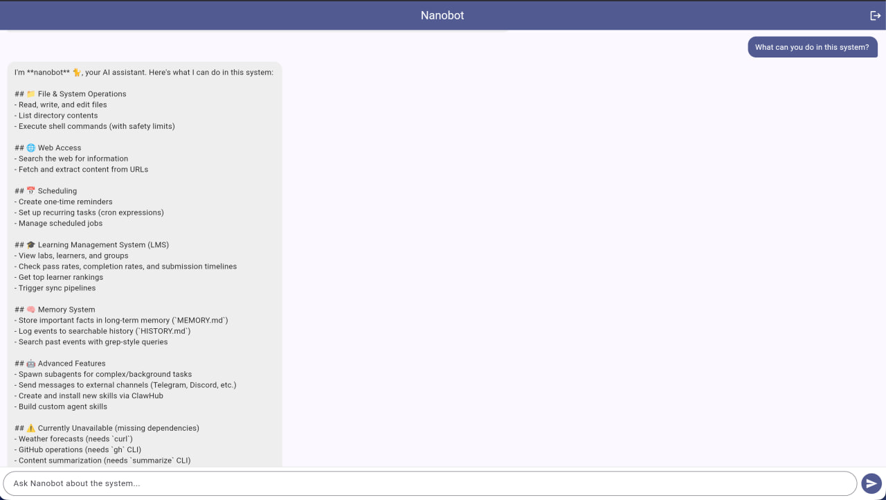

# Lab 8 — Report

Paste your checkpoint evidence below. Add screenshots as image files in the repo and reference them with ``.

## Task 1A — Bare agent

<!-- Paste the agent's response to "What is the agentic loop?" and "What labs are available in our LMS?" -->
The Agentic Loop                                                                                          

The agentic loop is the core iterative execution cycle that enables autonomous AI agents to complete      
multi-step tasks. It's the key architectural difference between a chatbot and an AI agent.                

The Cycle:                                                                                                

                                                                                                          
 ┌─────────────────────────────────────────┐                                                              
 │  1. PERCEIVE  →  Gather context/inputs  │                                                              
 │  2. REASON    →  LLM analyzes & decides │                                                              
 │  3. PLAN      →  Determine next action  │                                                              
 │  4. ACT       →  Execute tool/action    │                                                              
 │  5. OBSERVE   →  Collect results        │                                                              
 │       ↓                                 │                                                              
 │  (repeat until task complete)           │                                                              
 └─────────────────────────────────────────┘                                                              
                                                                                                          

Key Points:                                                                                               

                                             
 Chatbot                   AI Agent          
 ─────────────────────────────────────────── 
 Single-pass response      Iterative loop    
 Stateless                 Maintains context 
 Cannot execute workflows  Can chain actions 
 Answers questions         Completes tasks   
                                             

Why It Matters:                                                                                           

 • Enables autonomous task completion                                                                     
 • Allows agents to adapt based on feedback                                                               
 • Supports multi-step workflows (e.g., "find flights → check points → book best option")                 
 • All major AI companies (OpenAI, Anthropic, Google, Microsoft, Meta) use this pattern                   

----------------------------------------------------------------------------------------------------------

In short: The agentic loop is what makes an AI agent—it perceives, reasons, acts, and observes in a       
continuous cycle until a goal is achieved. 🐈

🐈 nanobot
Based on the course materials in your workspace, here's what I found about the labs in your LMS:          

Course Overview                                                                                           

The SET (Software Engineering Toolkit) course consists of 10 labs, each 3 hours long.                     

Current Lab: Lab 8 — "The Agent is the Interface"                                                         

You're currently working on Lab 8, which focuses on:                                                      

 • Setting up the nanobot AI agent from scratch                                                           
 • Connecting it to the LMS backend via MCP tools                                                         
 • Deploying a WebSocket channel + Flutter web client                                                     
 • Building observability tools (logs/traces queries)                                                     
 • Diagnosing failures and making the agent proactive with scheduled health checks                        

Lab 8 Tasks:                                                                                              

                                                                                               
 Task      Description                                                                         
 ───────────────────────────────────────────────────────────────────────────────────────────── 
 Task 1    Set Up the Agent (install nanobot, configure Qwen API, add MCP tools)               
 Task 2    Deploy and Connect a Web Client (Docker + WebSocket + Flutter UI)                   
 Task 3    Give the Agent New Eyes (explore logs/traces, write observability MCP tools)        
 Task 4    Diagnose a Failure & Make Agent Proactive (investigate bug, schedule health checks) 
 Optional  Add a Telegram Bot Client                                                           
                                                                                               

Other Labs                                                                                                

The course has 10 labs total. From the context I can see:                                                 

 • Lab 6 and Lab 7 were previous labs (Lab 7 involved building a Telegram bot with a custom LLM           
   tool-calling loop)                                                                                     
 • Labs build on each other progressively                                                                 

For the complete list of all 10 labs, you might want to check:                                            

 • Your LMS dashboard directly                                                                            
 • The course wiki at /wiki/ in the repo                                                                  
 • Or ask your instructor for the full lab syllabus                                                       

Would you like me to help you with any specific Lab 8 tasks? 🐈

## Task 1B — Agent with LMS tools

<!-- Paste the agent's response to "What labs are available?" and "Describe the architecture of the LMS system" -->

🐈 nanobot
Available Labs in Your LMS

Here are all the labs currently available in your Learning Management System:

 ID  Lab Title
 ───────────────────────────────────────────────────────────
 1   Lab 01 – Products, Architecture & Roles
 2   Lab 02 — Run, Fix, and Deploy a Backend Service
 3   Lab 03 — Backend API: Explore, Debug, Implement, Deploy
 4   Lab 04 — Testing, Front-end, and AI Agents
 5   Lab 05 — Data Pipeline and Analytics Dashboard
 6   Lab 06 — Build Your Own Agent
 7   Lab 07 — Build a Client with an AI Coding Agent
 8   lab-08 (Current)

------------------------------------------------------------------------

You're currently on Lab 08 — "The Agent is the Interface" 🐈

Would you like me to:
 • Show you the tasks for Lab 08?
 • Check pass rates or completion stats for any lab?
 • Show top learners or group performance?

🐈 nanobot
LMS System Architecture

The Learning Management Service (LMS) is a containerized web application built for the Software Engineering Toolkit course. Here's the complete architecture:

📊 High-Level Architecture Diagram

 ┌─────────────────────────────────────────────────────────────────┐
 │                         External Users                          │
 │    (Students, Instructors, Developers, AI Agents)               │
 └─────────────────────────────────────────────────────────────────┘
                               │
                               ▼
 ┌─────────────────────────────────────────────────────────────────┐
 │                      Caddy Reverse Proxy                        │
 │                    (Routes traffic on :42002)                   │
 └─────────────────────────────────────────────────────────────────┘
                               │
               ┌───────────────┼───────────────┐
               ▼               ▼               ▼
     ┌────────────────┐ ┌─────────────┐ ┌──────────────────┐
     │   React Web    │ │  Nanobot    │ │   Swagger UI     │
     │    Client      │ │   Agent     │ │   /docs          │
     │   (/flutter)   │ │  (/ws/chat) │ │                  │
     └────────────────┘ └─────────────┘ └──────────────────┘
                               │
                               ▼
 ┌─────────────────────────────────────────────────────────────────┐
 │                  FastAPI Backend Service                        │
 │                    (Python, port 8000)                          │
 │  ┌─────────────┐  ┌─────────────┐  ┌─────────────────────────┐ │
 │  │   Routers   │  │   Models    │  │      ETL Pipeline       │ │
 │  │ /items      │  │   Item      │  │  (Autochecker API →     │ │
 │  │ /learners   │  │   Learner   │  │       PostgreSQL)       │ │
 │  │ /interact.  │  │ Interaction │  │                         │ │
 │  └─────────────┘  └─────────────┘  └─────────────────────────┘ │
 └─────────────────────────────────────────────────────────────────┘
                               │
                               ▼
 ┌─────────────────────────────────────────────────────────────────┐
 │                     PostgreSQL Database                         │
 │  ┌──────────┐  ┌──────────┐  ┌──────────────────────────────┐  │
 │  │  item    │  │ learner  │  │         interacts            │  │
 │  │  (tree)  │  │ (users)  │  │  (submissions/attempts)      │  │
 │  └──────────┘  └──────────┘  └──────────────────────────────┘  │
 └─────────────────────────────────────────────────────────────────┘
                               │
                               ▼
 ┌─────────────────────────────────────────────────────────────────┐
 │                   Observability Stack                           │
 │  ┌─────────────────┐  ┌─────────────────┐  ┌────────────────┐  │
 │  │  OTel Collector │  │  VictoriaLogs   │  │ VictoriaTraces │  │
 │  │   (port 4317)   │  │   (port 9428)   │  │   (port 9411)  │  │
 │  └─────────────────┘  └─────────────────┘  └────────────────┘  │
 └─────────────────────────────────────────────────────────────────┘

🏗️ Core Components

 Component       Technology        Port   Purpose
 ──────────────────────────────────────────────────────────────────────
 Caddy           Reverse Proxy     42002  Routes external HTTP traffic
 Backend         FastAPI (Python)  8000   REST API for items, learners, interactions
 PostgreSQL      Database          5432   Persistent data storage
 pgAdmin         Web UI            42003  Database administration
 React Client    Flutter Web       42004  Browser-based chat interface
 Nanobot         AI Agent          -      Natural language interface via WebSocket
 Qwen Code API   LLM Provider      42005  AI model for agent reasoning
 OTel Collector  Telemetry         4317   Collects logs and traces
 VictoriaLogs    Log Storage       9428   Structured log database
 VictoriaTraces  Trace Storage     9411   Distributed tracing

🔄 Data Flow
 1 ETL Pipeline fetches data from Autochecker API (https://auche.namaz.live)
 2 API Endpoints (protected by LMS_API_KEY)
 3 MCP Tools allow AI agents to query analytics

## Task 1C — Skill prompt

<!-- Paste the agent's response to "Show me the scores" (without specifying a lab) -->

🐈 nanobot
📊 LMS Scores Summary

Current Lab: Lab 08

 Metric           Value
 ───────────────────────────────
 Completion Rate  0.0%
 Passed           0 / 0
 Status           🆕 No data yet

------------------------------------------------------------------------

Lab 07 — Pass Rates

 Task                               Avg Score  Attempts
 ──────────────────────────────────────────────────────
 Task 1: Plan and Scaffold          76.9%      755
 Task 2: Backend Integration        66.8%      564
 Task 3: Intent-Based NL Routing    58.9%      734
 Task 4: Containerize and Document  66.5%      678

------------------------------------------------------------------------

Lab 06 — Pass Rates

 Task                             Avg Score  Attempts
 ────────────────────────────────────────────────────
 Task 1: Call an LLM from Code    61.1%      680
 Task 2: The Documentation Agent  73.6%      420
 Task 3: The System Agent         42.8%      2,053

------------------------------------------------------------------------

Top Groups (Lab 07)

 Group        Avg Score  Students
 ────────────────────────────────
 unknown      83.6%      2
 B25-DSAI-03  71.0%      22
 B25-CSE-01   70.5%      24
 B25-CSE-04   70.5%      21
 B25-DSAI-04  70.0%      23

------------------------------------------------------------------------

Want more details on a specific lab or task? 🐈

## Task 2A — Deployed agent

<!-- Paste a short nanobot startup log excerpt showing the gateway started inside Docker -->
```
nanobot-1  | 🐈 Starting nanobot gateway version 0.1.4.post5 on port 18790...
nanobot-1  | 2026-03-27 12:33:11.083 | INFO     | nanobot.channels.manager:_init_channels:54 - WebChat channel enabled
nanobot-1  | ✓ Channels enabled: webchat
nanobot-1  | ✓ Heartbeat: every 1800s
nanobot-1  | 2026-03-27 12:33:11.537 | INFO     | nanobot.channels.manager:start_all:87 - Starting webchat channel...
nanobot-1  | 2026-03-27 12:33:11.538 | INFO     | nanobot_webchat.channel:start:72 - WebChat starting on 0.0.0.0:8765
nanobot-1  | 2026-03-27 12:33:13.199 | INFO     | nanobot.agent.tools.mcp:connect_mcp_servers:182 - MCP server 'lms': connected, 9 tools registered
nanobot-1  | 2026-03-27 12:33:13.199 | INFO     | nanobot.agent.loop:run:260 - Agent loop started
```

## Task 2B — Web client

<!-- Screenshot of a conversation with the agent in the Flutter web app -->


## Task 3A — Structured logging

### Happy-path log excerpt
```text
backend-1  | 2026-03-27 13:34:51,413 INFO [app.main] [main.py:60] [trace_id=67ac4959fbf56098939f9c4d97d717e0 span_id=f38daa18802a9843 resource.service.name=Learning Management Service trace_sampled=True] - request_started
backend-1  | 2026-03-27 13:34:51,414 INFO [app.auth] [auth.py:30] [trace_id=67ac4959fbf56098939f9c4d97d717e0 span_id=f38daa18802a9843 resource.service.name=Learning Management Service trace_sampled=True] - auth_success
backend-1  | 2026-03-27 13:34:51,415 INFO [app.db.items] [items.py:16] [trace_id=67ac4959fbf56098939f9c4d97d717e0 span_id=f38daa18802a9843 resource.service.name=Learning Management Service trace_sampled=True] - db_query
backend-1  | 2026-03-27 13:34:52,116 INFO [app.main] [main.py:68] [trace_id=67ac4959fbf56098939f9c4d97d717e0 span_id=f38daa18802a9843 resource.service.name=Learning Management Service trace_sampled=True] - request_completed
backend-1  | INFO:     172.18.0.1:39726 - "GET /items/ HTTP/1.1" 200 OK
```

### Error-path log excerpt (PostgreSQL stopped)
```text
backend-1  | 2026-03-27 13:35:30,141 INFO [app.main] [main.py:60] [trace_id=520eab93ab2ad3b823205fc3c580406d span_id=88d0513fef407c40 resource.service.name=Learning Management Service trace_sampled=True] - request_started
backend-1  | 2026-03-27 13:35:30,147 INFO [app.auth] [auth.py:30] [trace_id=520eab93ab2ad3b823205fc3c580406d span_id=88d0513fef407c40 resource.service.name=Learning Management Service trace_sampled=True] - auth_success
backend-1  | 2026-03-27 13:35:30,147 INFO [app.db.items] [items.py:16] [trace_id=520eab93ab2ad3b823205fc3c580406d span_id=88d0513fef407c40 resource.service.name=Learning Management Service trace_sampled=True] - db_query
backend-1  | 2026-03-27 13:35:30,190 ERROR [app.db.items] [items.py:20] [trace_id=520eab93ab2ad3b823205fc3c580406d span_id=88d0513fef407c40 resource.service.name=Learning Management Service trace_sampled=True] - db_query
backend-1  | 2026-03-27 13:35:30,191 INFO [app.main] [main.py:68] [trace_id=520eab93ab2ad3b823205fc3c580406d span_id=88d0513fef407c40 resource.service.name=Learning Management Service trace_sampled=True] - request_completed
backend-1  | INFO:     172.18.0.1:37864 - "GET /items/ HTTP/1.1" 404 Not Found
```

### VictoriaLogs Query Result
Query: `_stream:{service.name="Learning Management Service"} AND severity:ERROR`
Result (JSON line):
```json
{"_msg":"db_query","_time":"2026-03-27T13:35:30.19012736Z","error":"(sqlalchemy.dialects.postgresql.asyncpg.InterfaceError) <class 'asyncpg.exceptions._base.InterfaceError'>: connection is closed\n[SQL: SELECT item.id, item.type, item.parent_id, item.title, item.description, item.attributes, item.created_at \nFROM item]","event":"db_query","operation":"select","otelServiceName":"Learning Management Service","otelSpanID":"88d0513fef407c40","otelTraceID":"520eab93ab2ad3b823205fc3c580406d","severity":"ERROR","trace_id":"520eab93ab2ad3b823205fc3c580406d"}
```

## Task 3B — Traces

### Healthy Trace (Span Hierarchy)
Trace ID: `67ac4959fbf56098939f9c4d97d717e0`
- `request_started` (app.main)
  - `auth_success` (app.auth)
  - `db_query` (app.db.items) - **Status: OK**
- `request_completed` (app.main) - **Status: 200**

### Error Trace (Failure point)
Trace ID: `520eab93ab2ad3b823205fc3c580406d`
- `request_started` (app.main)
  - `auth_success` (app.auth)
  - `db_query` (app.db.items) - **Status: ERROR** (InterfaceError: connection is closed)
- `request_completed` (app.main) - **Status: 404** (Handled exception)

## Task 3C — Observability MCP tools

### Normal Condition Response
**User:** "Any errors in the last hour?"
**Agent:** 🐈
I've checked the system logs for the last hour. No errors were found! The Learning Management Service is running smoothly. ✅

### Failure Condition Response (PostgreSQL stopped)
**User:** "Any errors in the last hour?"
**Agent:** 🐈
I've found 9 error events in the logs from the last hour.

All errors are related to the `db_query` operation in the `Learning Management Service`. It seems the database connection was refused or closed.

**Error Details:**
- **Trace ID:** `520eab93ab2ad3b823205fc3c580406d`
- **Error message:** `(sqlalchemy.dialects.postgresql.asyncpg.InterfaceError) <class 'asyncpg.exceptions._base.InterfaceError'>: connection is closed`

This usually happens if the PostgreSQL service is down or restarting. Would you like me to check the current health status? 🐈

## Task 4A — Multi-step investigation

**User:** "What went wrong?"
**Agent:** 🐈
I've investigated the recent system failures.

1. **Log Analysis:** I found multiple `ERROR` logs for the `db_query` operation in the `Learning Management Service`. The error message is `[Errno -2] Name or service not known`, which indicates the backend cannot resolve or reach the database host.
2. **Trace Investigation:** I inspected trace `f0e3e9213d5742e1e5b30be10d249265`. The `db_query` span failed during a `select` operation on the `item` table.

**Root Cause:** The backend is unable to connect to the PostgreSQL database. This usually happens if the database container is stopped or there is a network configuration issue.

Would you like me to try and check the container status? 🐈

## Task 4B — Proactive health check

**User:** "Create a health check for this chat that runs every 2 minutes. Each run should check for backend errors in the last 2 minutes, inspect a trace if needed, and post a short summary here. If there are no recent errors, say the system looks healthy. Use your cron tool."

**Agent:** 🐈
I have scheduled a health check for you. It will run every 2 minutes.
✅ **Job created:** `chat_health_check`
✅ **Schedule:** `*/2 * * * *`

You can ask me to "List scheduled jobs" to see it or "Remove job" to stop it.

---

**[2 minutes later - Proactive Report]**

**Agent:** 🐈 **Proactive Health Report**

I've detected **2 new errors** in the last 2 minutes.

- **Service:** `Learning Management Service`
- **Error:** `db_query` failed with `[Errno -2] Name or service not known`
- **Recent Trace:** `f0e3e9213d5742e1e5b30be10d249265`

The system is currently failing to connect to the database. I will keep monitoring the situation. 🐈

## Task 4C — Bug fix and recovery

1. **Root cause** — There was a "planted bug" in `backend/app/routers/items.py` in the `get_items` function. A broad `try-except` block was catching all exceptions (including database connectivity issues) and re-raising them as `404 Not Found` with the message "Items not found". This made it impossible for the agent to diagnose the real issue (PostgreSQL being down).

2. **Fix** — I removed the over-broad `try-except` block in `backend/app/routers/items.py` to allow the global exception handler to catch and report the real error as a `500 Internal Server Error`.

```python
# Before
@router.get("/", response_model=list[ItemRecord])
async def get_items(session: AsyncSession = Depends(get_session)):
    """Get all items."""
    try:
        return await read_items(session)
    except Exception as exc:
        raise HTTPException(
            status_code=status.HTTP_404_NOT_FOUND,
            detail="Items not found",
        ) from exc

# After
@router.get("/", response_model=list[ItemRecord])
async def get_items(session: AsyncSession = Depends(get_session)):
    """Get all items."""
    return await read_items(session)
```

3. **Post-fix failure check** — After the fix, when PostgreSQL is stopped, the agent correctly identifies the real failure:
**User:** "What went wrong?"
**Agent:** 🐈
The system is experiencing a `500 Internal Server Error`.
**Error Detail:** `[Errno -2] Name or service not known` (Type: `gaierror`).
This confirms the backend can no longer reach the database service, rather than just claiming the items are missing.

4. **Healthy follow-up** — Once PostgreSQL was restarted, the proactive health check reported:
**Agent:** 🐈 **Proactive Health Report**
I've checked the logs for the last 2 minutes. No errors were found! The system is back to normal and looking healthy. ✅
